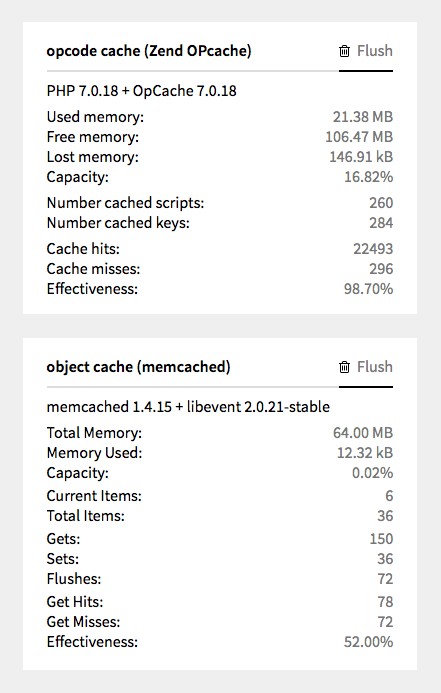
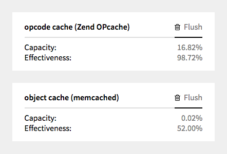

# Kirby Cache Widgets


[](https://github.com/omz13/kirby-cache-widgets/issues)

---

A plugin for Kirby that provides widgets to show details of and to flush the object cache and the php cache.

---

This is a plugin for [Kirby](https://getkirby.com) to provide two widgets in the panel to show the status of the PHP opcode cache (OPcache) and the PHP object cache (memcached, APC/APCu, or file). There is also the ability to flush each of these caches.



For those who prefer a minimalist approach, an option can be set to show the minimum.



## Installation

### 1. Kirby CLI

If you are using the [Kirby CLI](https://github.com/getkirby/cli) you can install this plugin by running the following command in your shell from the root folder of your Kirby installation:

```
$ kirby plugin:install omz13/kirby-cache-widgets
```

### 2. Manual
[Download this archive](https://github.com/omz13/kirby-cache-widgets/archive/master.zip), extract it and rename it to `kirby-cache-widgets`. Copy the folder to your `site/plugins` folder.

### 3. Git Submodule
If you know your way around git, you can download this as a submodule:

```
$ git submodule add https://github.com/omz13/kirby-cache-widgets site/plugins/version-widget
```

## Usage
You don't have anything to do once the widget is installed. These are informational widgets and they do not do anything to your site: they only report on the running status of the two cache sub-systems. There are two widgets that are shown in the panel.

NOTE: It is assumed that you are using a sensible pairing of ``OPcache`` for the opcode cache and ``memcached`` or ``file`` for the object cache.

The support for ``APC`` driver is PHP-version dependant and on the provision and availability of specific modules: PHP 5.x supports ``APC`` if the ``APC`` module is available (the original combined opcode and object cache); PHP 7.0 does not support the ``APC`` driver because while it does support the ``APCu`` module (a replacement for ``APC`` sans opcode caching) the necessary ``apcu-bc``module (a compatibility layer) is not supported so the issue is moot; PHP 7.1 supports the ``APC`` driver if both the ``APCu`` and ``apcu-bc`` modules are available (but note that this only provides the object cache part of ``APC`` and the opcode cache should be provided by the ``OPcache`` module). Yes, this is all a bit messy, and the logic flow to code with this requires a seriously strong cup of coffee (of whatever drink stimulates your synapses) the message is clear: use PHP 7.1 and enjoy the benefit of its ``OPcache`` module for opcode caching and use the ``memcached`` driver (because this is 2017 and you should have the ``memcached`` module installed) or fallback to the ``file`` driver (and ideally use SSD-based storage).

### 1. _object cache_ widget

This will show information about the Kirby-configured cache (```c::set('cache.driver')```). There are three possible drivers that can be used, and the widget will show different information for each:

- memcached
- apc
- file

#### memcached-based object cache

If the driver is ``memcached``, and the daemon is running, the _memcached_ widget will show applicable status information:

If the driver is ``memcached``, but the daemon is not running, or is running but has been disabled (``opcache.enable=0`` in its configuration file), the widget will show this.

#### apc-based object cache

If the driver is ``apc``, the widget will show that it has been configured and some basic operational information.

NOTE: This widget tests for the presence of the APCu module, which provides some level of compatibility with APC. If you are using APC, you will also need APC_BU.

#### file-based object cache

If the driver is ``file``, the widget will show that it is active.

### 2. _opcode cache_ widget

If the php environment has the ``opcache`` module loaded (and it really should be!), the _opcode cache_ widget will show some basic statistics.

If the ``opcache`` module is not available, or is available but has been disabled it its configuration (unlikely but possible), you will get a message to that effect.

## Options

The following option can be set in your `/site/config/config.php` file:

```php
c::set('plugin.cachewidget.panelpath', 'panel');
c::set('plugin.cachewidget.admincanflush', true );
c::set('plugin.cachewidget.usercanflush', 'username');
c::set('plugin.cachewidget.verbose', false );
c::set('plugin.cachewidget.terse', false );
c::set('plugin.cachewidget.showdiagnostics', false );
```

### plugin.cachewidget.panelpath

Default: ```panel```

If the panel is not located at ```/panel```, use this option to specify where it is.

### plugin.cachewidget.admincanflush

Default: ```true```

If ```true```, all users who have Admin privilege can flush the caches.

### plugin.cachewidget.usercanflush

If set, this can be either a single user, or an array or users, who can be allowed to flush the caches.

### plugin.cachewidget.verbose

Default: ```false```

If ```true```, the cache widgets will show lots of information and in a very 'raw' manner.

### plugin.cachewidget.terse

Default: ```false```

If ```true```, the cache widgets will show a minimal amount of information, usually limited to just the capacity and effectiveness.

Note: the verbose option takes priority over terse option.

### plugin.cachewidget.showdiagnostics

Default: ```false```

If ```true```, an additional diagnostic widget is shown. This is for development purposes only and shouldn't normally be needed.

## To-do

- [x] Display only for users with admin role
- [ ] Localization?

## Help & Improve <a id="Help"></a>

If you find any bugs, have troubles or ideas, etc., please let me know [by opening a new issue](https://github.com/omz13/kirby-cache-widgets/issues/new).

## Requirements

Kirby 2.4.1

## License
[MIT License](http://www.opensource.org/licenses/mit-license.php)

## Author

David Somers - [@omz13](https://twitter.com/omz13)

## Changelog

### 0.1
- Initial release